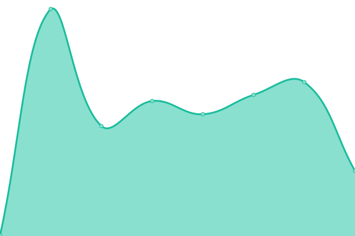

# [📈 Live Status](https://status.faststats.dev): <!--live status--> **🟩 All systems operational**

<!--start: status pages-->
<!-- This summary is generated by Upptime (https://github.com/upptime/upptime) -->
<!-- Do not edit this manually, your changes will be overwritten -->
<!-- prettier-ignore -->
| URL | Status | History | Response Time | Uptime |
| --- | ------ | ------- | ------------- | ------ |
|  [Frontend](https://faststats.dev) | 🟩 Up | [frontend.yml](https://github.com/faststats-dev/status/commits/HEAD/history/frontend.yml) | 

 722ms
     
 | 

<a href="https://status.faststats.dev/history/frontend">100.00%</a>
    

|  [Data Collector](https://metrics.faststats.dev/v1/health) | 🟩 Up | [data-collector.yml](https://github.com/faststats-dev/status/commits/HEAD/history/data-collector.yml) | 

 394ms
     
 | 

<a href="https://status.faststats.dev/history/data-collector">100.00%</a>
    

|  [Data Exporter](https://export.faststats.dev/v1/health) | 🟩 Up | [data-exporter.yml](https://github.com/faststats-dev/status/commits/HEAD/history/data-exporter.yml) | 

 449ms
     
 | 

<a href="https://status.faststats.dev/history/data-exporter">100.00%</a>
    

<!--end: status pages-->

## 📄 License

- Code: [MIT](./LICENSE) © [Anand Chowdhary](https://anandchowdhary.com), supported by [Pabio](https://pabio.com)
- Data in the `./history` directory: [Open Database License](https://opendatacommons.org/licenses/odbl/1-0/)
